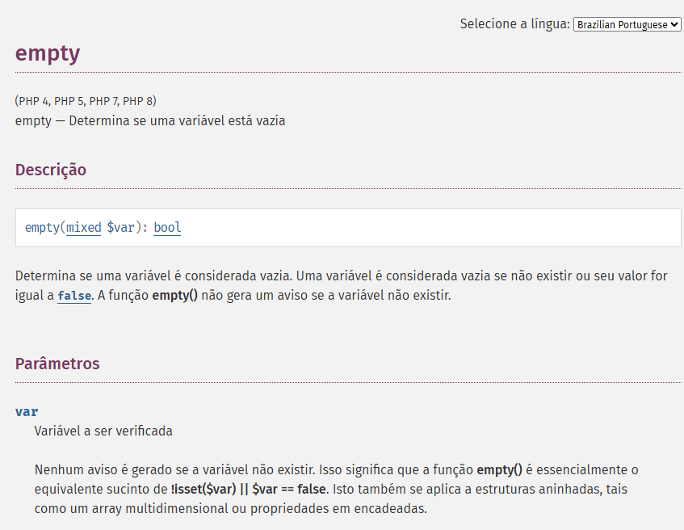

# php_design_partens
Curso de PHP e Design Partens

## Aula05
Abordamos sobre comando que exibem algum conteudo na tela
vimos os seguintes comandos:
`print_r()`
`var_dump()`
Este **comandos** ajudam a debugar o codigo de uma 
forma mais rápida e flexivel.
## Aula06
Nesta aula nós abordamos sobre variaveis em **PHP** e vimos que em PHP
as variaveis podem ser *concatenadas* de várias formas.
como:
`$nome_completo = $nome . " " . $sobrenome`
`$nome_completo = "{$nome} {$sobrenome}"`
### Resultado
*Josimar Martins*
*Josimar Martins*

Como poderam observar o resultado é o mesmo são maneiras distintas de fazer
mas que chegam ao mesmo resultado a sengunda maneira pode se tornar mais eficaz no
quesito de organização do código ela ajuda a separar variaveis de outras `string` que não fazem parte do nome com que a váriavel foi declarada. 

Vimos ainda que o **PHP** converte valores de variáveis no momento em que elas serão utilizadas. 

**Ex:**
```
$a = "12";
$b = 13;

var_dump($a * $b);
```
**O resultado continurá a ser sempre 156**
Mas se colocarmos alguma letra antes do número entre aspas
o **PHP** irá apresentar erro.
```
$a = "12";
$b = 13;

var_dump($a * $b);
```
***
Fatal error: Uncaught TypeError: Unsupported operand types: int * string in C:\Users\Josemar da Conceição\Documents\GitHub\php_design_partens\modulo-01\aula06\variaveis.php:50
Stack trace:
#0 {main}
thrown in C:\Users\Josemar da Conceição\Documents\GitHub\php_design_partens\modulo-01\aula06\variaveis.php on line 50
***

Vimos também tipos booleanos, vimos que o **PHP** entende que variáveis que
possuem valor nulo ou "" ou 0(0.0) são consideradas variáveis com valor `false`.

```
$a = 0;
var_dump($a);

```

*** 
Tivemos uma intrução a objectos e vimos que objectos em **PHP** por padrão
são passados com referêcia.
**Ex:**
```
$pessoa1 = new StdClass;
$pessoa1->nome = "Josimar";
$pessoa2 = $pessoa1;
$pessoa2->nome = "Daniel";

print $pessoa1->nome;
```

### Resultado
Daniel

Isso acontence porque o objecto `$pessoa2` aponta para mesma posição de
memória em que o objecto `$pessoa1` está a apontar então qualquer alterção afecta o outro.


